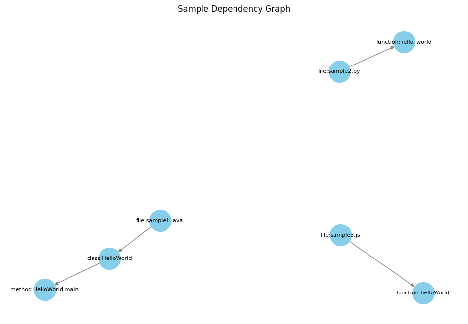

# RepoMind - Intelligent Coding Assistant

RepoMind is an AI-powered coding assistant that provides intelligent code understanding and generation capabilities. The project consists of a codebase analysis system for deep code understanding and a VS Code extension for the user interface.

## Features

### Codebase Analysis System
- AST parsing with Tree-sitter for multiple languages
- Hierarchical semantic code chunking
- Dependency analysis and relationship mapping
- Structural integrity and context preservation
- Comprehensive metadata for code understanding
- Memory-optimized processing for large codebases
- Vector database integration with LanceDB
- Code embedding generation using CodeBERT
- Optional dependency graph visualization
- Unified storage for vectors and graph metadata
- Command-line interface for various operations
- Multi-hop RAG for intelligent code retrieval
- Custom relevance scoring combining semantic and structural relevance

## Completed Components

### 1. Tree-sitter Integration
- Integrated Tree-sitter for AST parsing
- Added support for multiple programming languages
- Implemented utility functions for AST traversal and analysis
- Created specialized Java parser for detailed analysis

### 2. Semantic Code Chunking
- Designed and implemented semantic chunking algorithm based on AST structure
- Created hierarchical chunking with fine-grained and container-level chunks
- Ensured structural integrity and context preservation
- Added comprehensive metadata for dependency relationships
- Implemented visualization utilities for chunk hierarchy

### 3. Vector Database Integration
- Installed and configured LanceDB for storing code embeddings
- Created comprehensive schema for code chunks and dependency relationships
- Implemented version-compatible database manager with schema validation
- Added robust error handling and logging
- Designed flexible schema with minimal and full versions
- Created database utility scripts for connection management

### 4. Code Embedding Generation
- Implemented embedding generation using CodeBERT
- Added batch processing for efficient embedding generation
- Implemented caching to avoid regenerating embeddings for the same code
- Created utility scripts for embedding code chunks and storing them in the database

### 5. Dependency Graph Construction
- Built dependency graph construction system
- Implemented visualization utilities for code relationships
- Created command-line interface for dependency graph operations
- Added database integration for storing and querying dependencies

### 6. Retrieval-Augmented Generation (RAG)
- Implemented multi-hop retrieval approach for code understanding
- Created architectural pattern retrieval based on semantic similarity
- Developed implementation details retrieval using both semantic and structural relevance
- Built custom relevance scoring combining vector similarity and graph proximity
- Designed context assembly mechanism for LLM prompts
- Added comprehensive testing for RAG components

## Prerequisites

- Python 3.8 or later
- Git

## Setup Instructions

### Codebase Analyser Setup

1. Clone the repository:
```bash
git clone https://github.com/yourusername/repomind.git
cd repomind/codebase-analyser
```

2. Create a Python virtual environment:
```bash
python -m venv venv
source venv/bin/activate  # On Windows: venv\Scripts\activate
```

3. Install dependencies:
```bash
pip install -r requirements.txt
```

4. Run a test to verify the installation:
```bash
python test_parser.py samples/SimpleClass.java
```

### Database Location

The codebase analyzer uses LanceDB to store code embeddings and dependencies. By default, the database is stored in:

```
codebase-analyser/.lancedb
```

You can specify a different location using the `--db-path` parameter in most commands.

### Running the Codebase Analyser

#### Parsing and Chunking

```bash
python test_parser.py <file_path>
```
You may use paths from sample. 
#### Generating Embeddings

```bash
python test_embeddings.py
```

#### Building Dependency Graphs

```bash
python test_dependency_graph.py
```

#### Visualizing Dependency Graphs

```bash
# Generate a PNG visualization
python -m codebase_analyser.graph.cli visualize samples/dependency_graph.json --output-file samples/graph.png

# Generate a DOT file for Graphviz
python -m codebase_analyser.graph.cli visualize samples/dependency_graph.json --format dot --output-file samples/dependency_graph.dot

# Customize the visualization
python -m codebase_analyser.graph.cli visualize samples/dependency_graph.json --layout circular --node-size 1500
```

#### Testing RAG Components

```bash
# Test the RAG pipeline
python test_rag.py

# Test with custom requirements
python test_rag.py --requirements-file path/to/requirements.json
```

The dependency graph visualization provides insights into code relationships:



## Project Structure

```
codebase-analyser/
├── codebase_analyser/           # Main package
│   ├── parsing/                 # Code parsing and chunking
│   │   ├── analyser.py          # Main analyzer class
│   │   ├── ast_utils.py         # AST utility functions
│   │   ├── code_chunk.py        # Code chunk data model
│   │   ├── chunker.py           # Code chunking logic
│   │   ├── dependency_analyzer.py # Dependency analysis
│   │   ├── dependency_types.py  # Dependency type definitions
│   │   └── java_parser.py       # Java-specific parser
│   ├── database/                # Database integration with LanceDB
│   ├── embeddings/              # Code embedding generation
│   ├── graph/                   # Dependency graph functionality
│   ├── retrieval/               # Multi-hop RAG implementation
│   └── agent/                   # LangGraph agent components
├── tests/                       # Test directory
│   ├── test_parsing.py          # Tests for parsing and chunking
│   ├── test_database.py         # Tests for database functionality
│   ├── test_embeddings.py       # Tests for embedding generation
│   ├── test_graph.py            # Tests for graph functionality
│   └── fixtures/                # Test fixtures
├── samples/                     # Sample files and outputs
└── requirements.txt             # Python dependencies
```

## Documentation

For more detailed information, see the following documentation:

- [Project Plan](docs/PLAN.MD) - Detailed project plan and roadmap
- [Codebase Analyser README](codebase-analyser/README.md) - Detailed documentation for the codebase analyser

## License

This project is licensed under the MIT License - see the LICENSE file for details.
